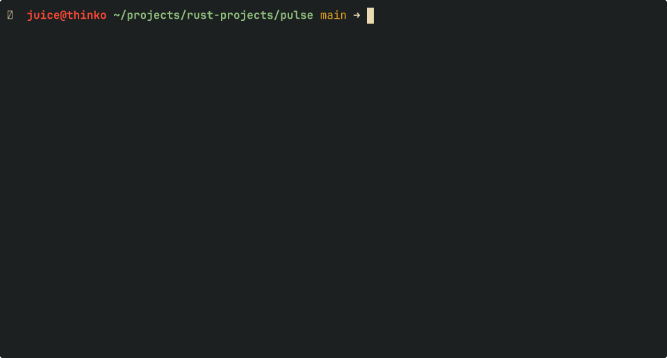

# Pulse
A lightweight Linux system observability, CLI written in Rust.



Pulse provides real-time system and process-level metrics by reading directly from the Linux `/proc` filesystem and computing derived CPU usage using time-delta sampling.

---

## ⚙️ Current Features (v0.3)

### 🖥️ System Metrics
- CPU usage (delta-based calculation)
- Memory usage (% used)
- System uptime

### 📊 Process Monitoring (`pulse top`)
- Per-process CPU usage (delta-based sampling)
- Memory usage (RSS)
- Live process ranking
- Real-time updating display (1s refresh loop)

---

## 🧠 How It Works

Pulse reads raw system data directly from Linux:

- `/proc/stat` → total CPU time
- `/proc/[pid]/stat` → per-process CPU time
- `/proc/[pid]/status` → memory usage
- `/proc/meminfo` → system memory
- `/proc/uptime` → system uptime

---

## ⚡ CPU Usage Model

CPU usage is computed using a delta-based sampling approach:

(sample_t1 - sample_t0) → CPU utilization over time

For processes:

(process_delta / total_delta) × 100

---

## 🏗️ Architecture & Design

Pulse is built with a decoupled, data-driven pipeline to ensure that heavy system I/O never blocks the TUI rendering thread.

### 🧱 System Flow
```text
  ┌──────────────┐      ┌──────────────────────────────┐
  │  CLI Layer   │ ──── │        Engine Layer          │
  └──────────────┘      │   (Orchestration & State)    │
                        └──────────────┬───────────────┘
                                       │
                ┌──────────────────────┴──────────────────────┐
                ▼                                             ▼
      ┌───────────────────┐                         ┌───────────────────┐
      │     Collector     │                         │    State Store    │
      │    (/proc IO)     │                         │    (Snapshots)    │
      └─────────┬─────────┘                         └─────────┬─────────┘
                │                                             │
                └──────────────────────┬──────────────────────┘
                                       ▼
                             ┌───────────────────┐
                             │   View Builder    │
                             │  (Sort / Filter)  │
                             └─────────┬─────────┘
                                       ▼
                             ┌───────────────────┐
                             │     Renderer      │
                             │  (Ratatui / TUI)  │
                             └───────────────────┘
```
---

## 📁 Structure
```text
src/
├── main.rs              # CLI entry point
├── lib.rs               # system module exposure
├── cli/                 # CLI layer
│   ├── status.rs
│   ├── top.rs
│   └── mod.rs
└── system/              # system engine
    ├── cpu.rs
    ├── memory.rs
    ├── uptime.rs
    ├── process.rs
    ├── snapshot.rs
    ├── sampler.rs       # orchestration layer
    └── mod.rs
```
---

## 📌 Design Goals

- Keep system logic separate from CLI
- Model real OS-level observability patterns
- Use Linux-native interfaces (/proc)
- Build from first principles (no external monitoring tools)
- Maintain clarity over premature optimization

---

## ⚠️ Limitations

- Linux only (depends on /proc)
- Full process scan per refresh cycle
- CPU sampling sensitive to timing window
- No historical metrics storage
- No persistent state between runs
- Terminal rendering uses full redraw (can flicker)

---

## 🚧 Roadmap

### Phase 2 — Architecture Stabilization
- Separate sampling, computation, and state layers
- Reduce duplication in snapshot + process systems
- Introduce persistent process state across loops

### Phase 3 — Performance & Accuracy
- Optimize /proc scanning
- Reduce redundant file reads
- Improve CPU normalization across cores
- Handle process churn more gracefully

### Phase 4 — UI Improvements
- Reduce terminal flicker
- Add structured rendering layout
- Introduce configurable refresh rates

### Phase 5+ — Advanced Observability
- Historical metrics storage
- Time-series analysis
- Export formats (JSON, logs)
- Potential eBPF integration (future exploration)

---

## 🧠 Philosophy

Pulse is not a wrapper around system tools. It is an attempt to reconstruct system observability from first principles.

The goal is understanding how the system behaves, not abstracting it away.

---

## 📊 Current State

Pulse has reached a working real-time monitoring baseline with process-level CPU tracking and continuous system observation.

It is transitioning from a snapshot-based CLI tool into a live system monitoring engine.
