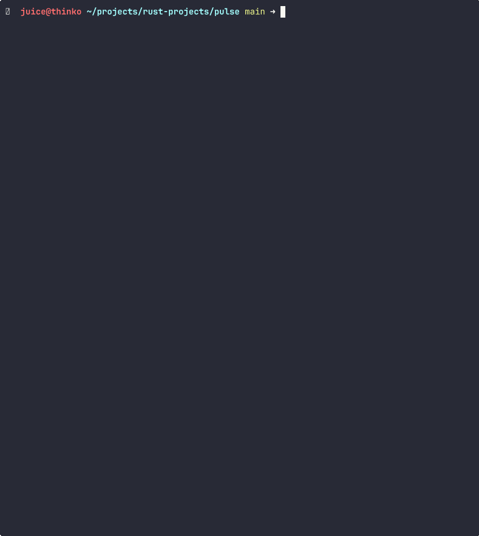
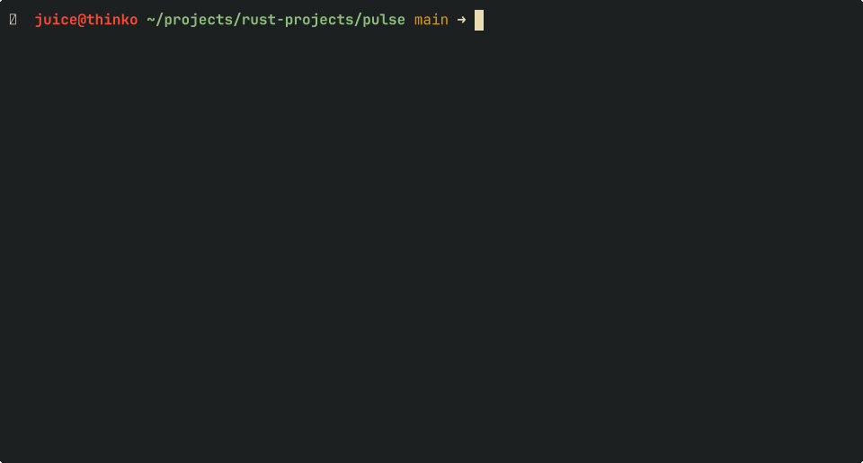

# Pulse

<p align="center">
  
</p>

<p align="center">
  <strong>An open-source Linux observability TUI built with Rust.</strong><br/>
  Combining low-overhead <code>/proc</code> telemetry with real-time eBPF kernel lifecycle tracing.<br/><br/>
  <a href="https://josiah-mbao.github.io/pulse/"><strong>🌐 Live Website &amp; Documentation</strong></a>
</p>

<p align="center">
  
  
  
</p>

---

## 🎭 Visual Evolution

### Latest — v0.7 "Zinc & Rust"



### Original — v0.1



*Live terminal recordings generated with [asciinema](https://asciinema.org).*

---

# 🌱 The Origin Story

Pulse started on a whim and a hand-me-down laptop.

After reviving an old machine with Arch Linux and building a custom Hyprland desktop, I found myself constantly reaching for `top` and `htop` whenever something felt slow.

Watching thousands of values update in real time sparked a question:

> **How can these tools continuously observe an entire Linux system without becoming the bottleneck themselves?**

Arch Linux encourages understanding your system from the ground up, so I decided to extend that philosophy to application development.

Rather than treating Linux as a black box, I wanted to understand how observability works from the kernel upward—how processes are born, how resources are consumed, and how telemetry moves from the operating system into a responsive user interface.

Pulse is the result of that exploration.

---

# ⚙️ Features

## 🔍 Trace — eBPF Process Lifecycle Lens

Observe process activity directly from the Linux kernel.

- **Kernel Event Streaming** — Captures `sched_process_exec` and `sched_process_exit` events using Aya-powered eBPF tracepoints.
- **Zero-Allocation Reducer** — Propagates kernel events through a bounded lock-free ring buffer into the UI.
- **Bounded Event History** — Retains the latest 500 lifecycle events while preventing unbounded memory growth.
- **Trace Lens** — Dedicated dashboard (`4`) highlighting `EXEC` events in green and `EXIT` events in crimson.

---

## 🛰️ Sentinel — Network Lens

Real-time network interface observability.

- Interface operational status
- RX / TX throughput
- Receive and transmit errors
- Stable interface ordering

---

## 📈 EKG — Telemetry Lens

System-wide performance telemetry.

- Live CPU sparklines
- Memory utilization
- Disk read/write velocity
- Rolling historical metrics

---

## 🚢 Fleet — Process Lens

Navigate and manage running processes.

- Stateless filtering
- Fast searching
- Namespace-aware grouping
- Send `SIGTERM` and `SIGKILL` directly from the UI

---

# 🧱 Architecture

Pulse uses a multi-threaded producer-consumer architecture that ensures filesystem polling and kernel event collection never block terminal rendering.

```text
       KERNEL SPACE            │                 USERSPACE (TUI)
                               │
 ┌──────────────────────────┐  │  ┌───────────────┐      ┌────────────────┐
 │   sched_process_exec/    │  │  │  TUI Renderer │      │    Collector   │
 │   sched_process_exit     │  │  │ (Stateless v4)│      │ (/proc parser) │
 └────────────┬─────────────┘  │  └───────┬───────┘      └───────┬────────┘
              │ (eBPF RingBuf) │          ▲                      │
              ▼                │          │                      │
 ┌──────────────────────────┐  │   View DTO Frame         SystemEvent
 │   ebpf_collector Thread  ├──┼──────────┼──────────────────────┘
 │   (Aya-driven consumer)  │  │   ┌──────┴──────────┐
 └──────────────────────────┘  │   │Projection Engine│◄── AppState Reducer
                               │   └─────────────────┘
```

The architecture separates collection, reduction, and rendering into independent stages, allowing Pulse to maintain responsive terminal performance even under heavy system activity.

---

# 📁 Workspace Structure

Pulse is organized as a multi-crate Rust workspace.

| Crate | Purpose |
|-------|---------|
| **pulse** | Main application, reducers, state management and Ratatui renderer |
| **pulse-common** | Shared `#![no_std]` POD types between kernel and userspace |
| **pulse-ebpf** | Aya eBPF kernel program |
| **xtask** | Build automation, tracing utilities and CI helpers |

---

# ⚡ Getting Started

## Quick Install (Binary)

Install the prebuilt self-contained `pulse` binary via one-line installer:

```bash
curl -fsSL https://raw.githubusercontent.com/josiah-mbao/pulse/main/scripts/install.sh | sh
```

---

## 🦀 Via Cargo (Rust Ecosystem)

Install directly from GitHub repository:

```bash
cargo install --git https://github.com/josiah-mbao/pulse.git
```

---

## 🔒 Permissions & Capabilities

| Execution Mode | Command | Privileges | Features Available |
|---|---|---|---|
| **Unprivileged Mode** | `pulse` | Standard User | Process Fleet, EKG Telemetry, Sentinel Network, Filtering, Sorting |
| **eBPF Kernel Mode** | `sudo pulse` | `root` or `CAP_BPF` + `CAP_PERFMON` | All `/proc` features + Real-time eBPF `sched_process_exec`/`exit` Trace Lens |

---

## Building From Source

### Prerequisites

- Rust (Nightly for eBPF target)
- LLVM / Clang
- `bpf-linker`

```bash
cargo install bpf-linker
```

---

## Clone & Build

```bash
git clone https://github.com/josiah-mbao/pulse.git
cd pulse

# 1. Build eBPF bytecode (embedded automatically by build.rs)
cargo run --package xtask -- build-ebpf

# 2. Build release binary
cargo build --release
```

---

## Run Pulse

```bash
# Unprivileged /proc mode
./target/release/pulse

# eBPF Kernel Tracing mode
sudo ./target/release/pulse
```

Switch between observability lenses:

| Key | Lens |
|----|------|
| `1` | Fleet |
| `2` | EKG |
| `3` | Sentinel |
| `4` | Trace |

---

# 🛠️ Development

### Live Trace Console

Stream kernel lifecycle events directly to the terminal.

```bash
sudo cargo run --package xtask -- trace
```

---

### Quality Gates, Tests & Benchmarks

Run formatting, linting, unit/integration tests, and microbenchmarks:

```bash
# Workspace CI checks
cargo run --package xtask -- ci

# Full Test Suite (87 tests)
cargo test --workspace

# Criterion Microbenchmarks
cargo bench -- --test
```

---

# 📄 License

Pulse is open source and released under the MIT License.

See [LICENSE](LICENSE).
